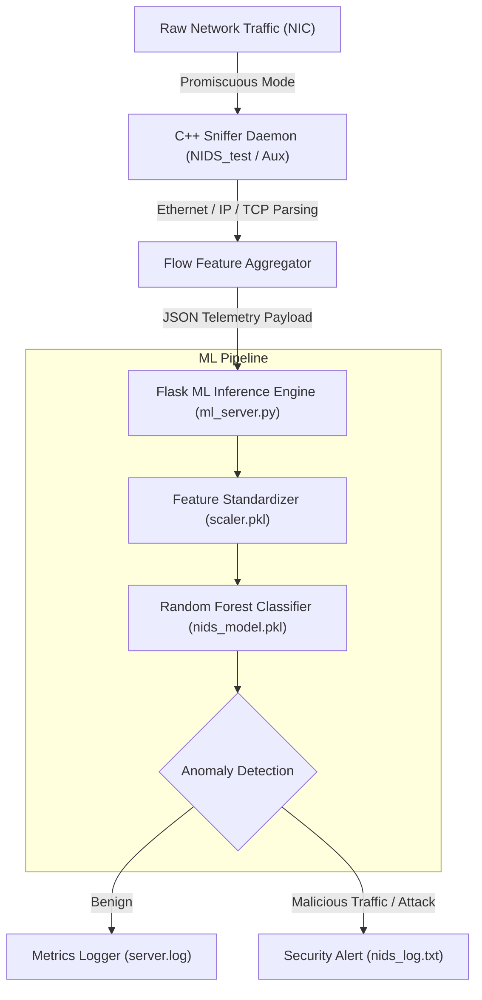

# NIDS-ML: Hybrid Machine Learning Network Intrusion Detection System

<p align="center">
  
  
  
  
  
</p>

A high-performance, real-time **Network Intrusion Detection System (NIDS)** that bridges low-level C++ network packet capture with an asynchronous machine learning inference pipeline for multi-vector threat classification.

---

## Architecture Overview



---

## Key Features

- **Hybrid Architecture**: Fast C++ binary execution for wire-speed packet interception paired with Python scikit-learn for intelligent decision making.
- **Bi-Directional Flow Reconstruction**: Tracks active connection pairs (client ↔ server), calculating packet length bounds, inter-arrival statistics, and window sizing.
- **L7 Protocol Identification**: Integrated mapping of application layer protocols (HTTP, HTTPS, DNS, SSH, Telnet, SMTP, SNMP).
- **TCP State Profiling**: Evaluates TCP flags (`SYN`, `ACK`, `FIN`, `RST`, `PSH`, `URG`) and window sizes (`win_max_in`, `win_max_out`) to detect scanning and state anomalies.
- **Automated Memory Cleanup**: Periodic expiration of stale and idle flows with thread-safe synchronization.
- **Detailed Forensic Logging**: Comprehensive telemetry stored across `server.log` and `nids_log.txt` for incident response analysis.

---

## Directory Structure

```text
NIDS_ML/
├── Aux_Program.c++          # C++ auxiliary packet processing & socket streamer
├── NIDS_test.c++            # Primary C++ packet sniffer daemon
├── ml_server.py             # Flask inference server & flow aggregator
├── nids.py                  # Standalone Python traffic analyzer & tester
├── features.json            # Machine learning feature order specification
├── cluster_protocol_map.json# Protocol mapping configuration
├── nids_model_cpu.pkl       # Serialized Random Forest model pipeline
├── scaler.pkl               # Standard preprocessor scaler
└── README.md                # Project documentation
```

---

## Prerequisites & Installation

### 1. System Requirements
- Linux OS (Kali Linux, Ubuntu 20.04+, Debian)
- `g++` compiler supporting C++17 or newer
- `libpcap-dev`
- Python 3.10+

### 2. Python Environment Setup
```bash
git clone https://github.com/ShanawazAlam007/NIDS_ML.git
cd NIDS_ML

python3 -m venv venv
source venv/bin/activate
pip install flask joblib scikit-learn pandas numpy requests
```

### 3. Compile C++ Packet Sniffing Daemon
```bash
g++ -O3 -std=c++17 NIDS_test.c++ -o NIDS_test -lpthread
g++ -O3 -std=c++17 Aux_Program.c++ -o Aux_Program -lpthread
```

---

## Usage Guide

### Step 1: Launch the ML Inference Engine
Start the Flask classification server:
```bash
python3 ml_server.py
```
*The server loads the pre-trained Random Forest model and listens on `http://127.0.0.1:5000/predict`.*

### Step 2: Start Packet Capture
Run the C++ network sniffer with root permissions on your active interface (e.g., `eth0` or `wlan0`):
```bash
sudo ./NIDS_test eth0
```

### Step 3: Monitor Detection Logs
Stream real-time classification alerts:
```bash
tail -f server.log
tail -f nids_log.txt
```

---

## Machine Learning Feature Schema

The classifier relies on 20+ extracted network flow features:

| Feature Name | Description |
| :--- | :--- |
| `in_bytes` / `out_bytes` | Directional byte volumes transferred |
| `in_pkts` / `out_pkts` | Directional packet count per flow |
| `longest_pkt` / `shortest_pkt` | Packet size distribution boundaries |
| `ttl_max` / `ttl_min` | Time-to-Live variance indicators |
| `tcp_flags` | Cumulative TCP flag mask |
| `win_max_in` / `win_max_out` | TCP maximum window scale parameters |
| `l7_proto` | Inferred application layer protocol |

---

## Security & Ethical Disclaimer

This software is developed strictly for academic research, defensive network monitoring, and educational purposes. Ensure you have authorized permission before deploying packet capture software on any network.
